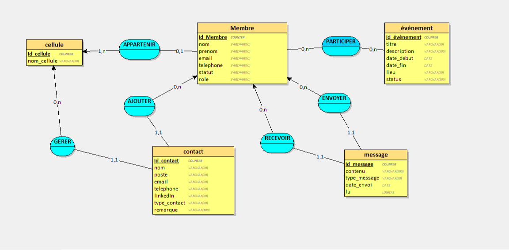
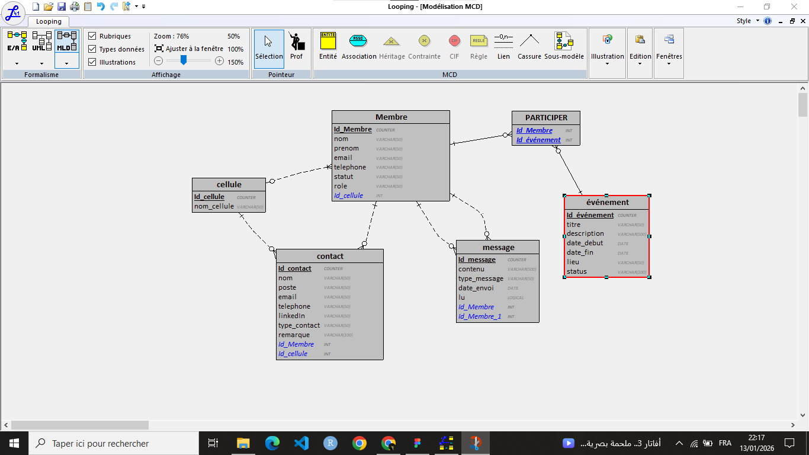

# Documentation MCD et MLDR

## MCD

## MLDR

Description :
- Ce MCD représente les entités et associations du projet EIC Management System.
- Le MLDR est dérivé du MCD et montre les types de données et les relations pour la base de données.
